# Social Network API

 

## License

 

[This application is under the MIT license](https://opensource.org/licenses/MIT)

 

## Walkthrough Video

 

**To-Do**

 

## Table of Contents

 

**To-Do**

 

## Description

 

An API for a social network web application where users can share their thoughts, react to friends’ thoughts, and create a friend list.

 

## Usage

 

To create a user, make a **POST** request in Insomnia/Postman/etc. to `http://localhost:3001/api/users`, with the user's **username** and **email** in **JSON format**.

 

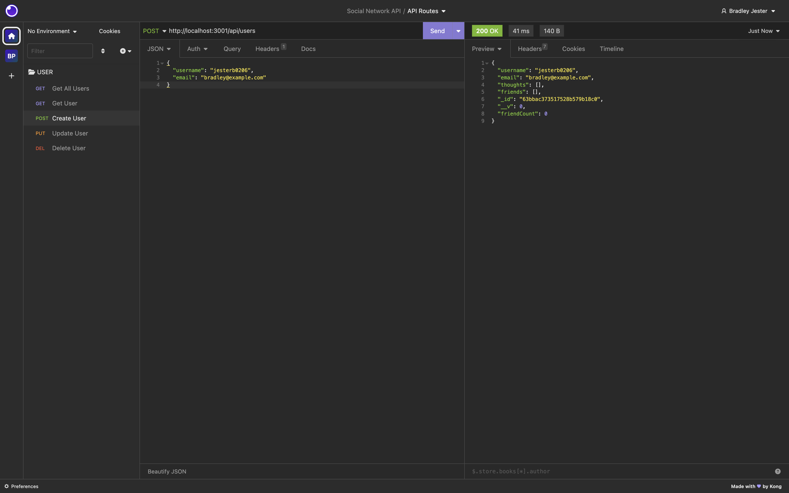

 

To get a specific user, make a **GET** request in Insomnia/Postman/etc. to `http://localhost:3001/api/users/:userId`, replacing **:userId** with that user's unique ID.

 

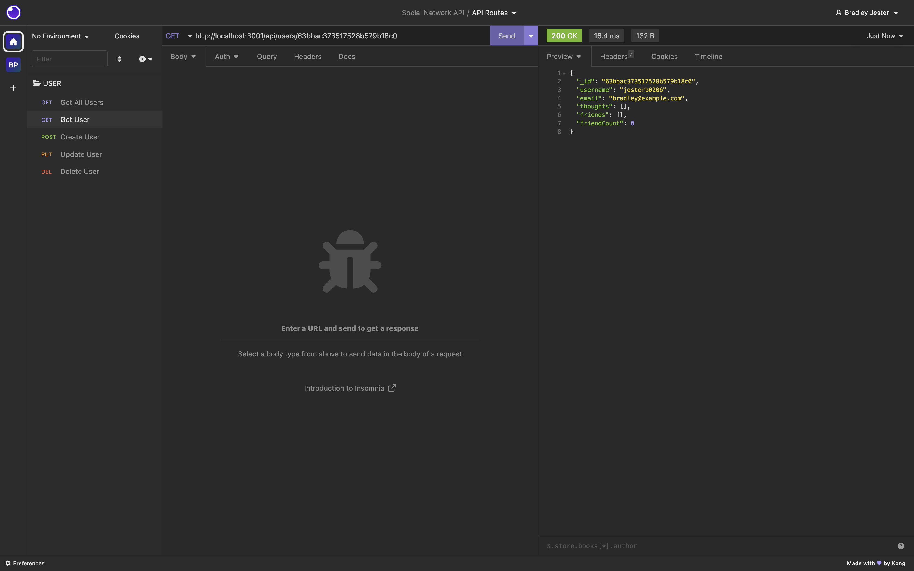

 

To get all of the users, make a **GET** request in Insomnia/Postman/etc. to `http://localhost:3001/api/users`.

 

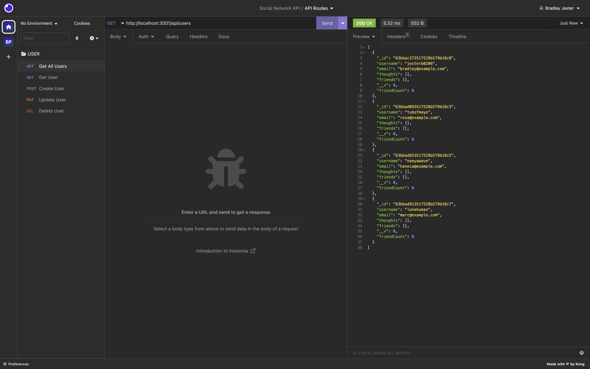

 

To update a specific user, make a **PUT** request in Insomnia/Postman/etc. to `http://localhost:3001/api/users/:userId` (in **JSON format**), replacing **:userId** with that user's unique ID.

 

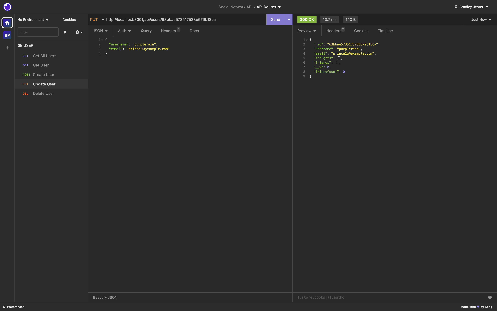

 

To delete a specific user, make a **DELETE** request in Insomnia/Postman/etc. to `http://localhost:3001/api/users/:userId`, replacing **:userId** with that user's unique ID.

 

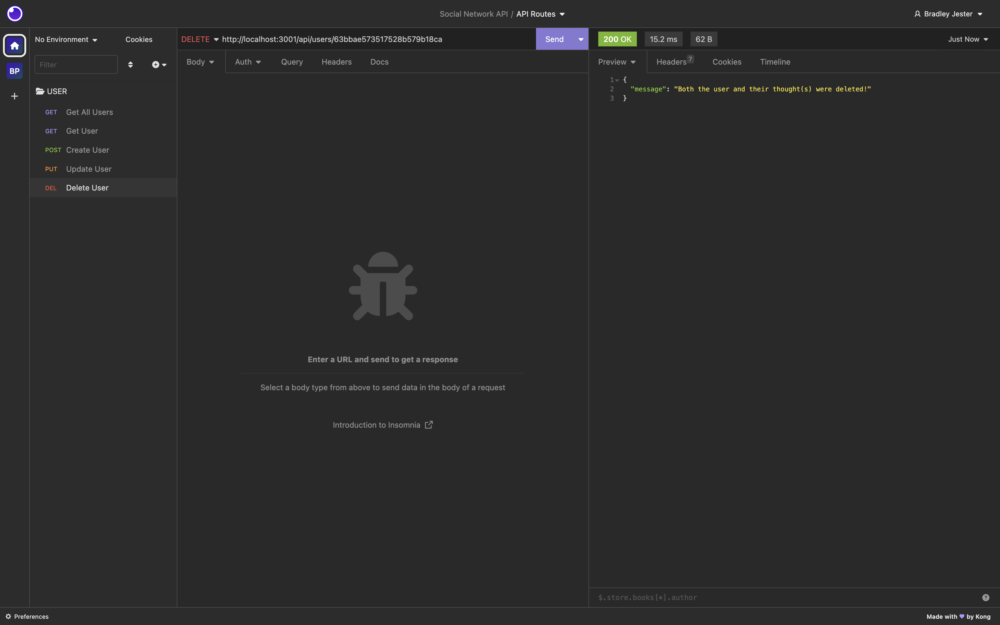

 

To add a friend to a user's friend list, make a **POST** request in Insomnia/Postman/etc. to `http://localhost:3001/api/users/:userid/friends/:friendId`, replacing **:userId** with that user's unique ID and **:friendId** with the unique ID of the user that they wish to become friends with.

 

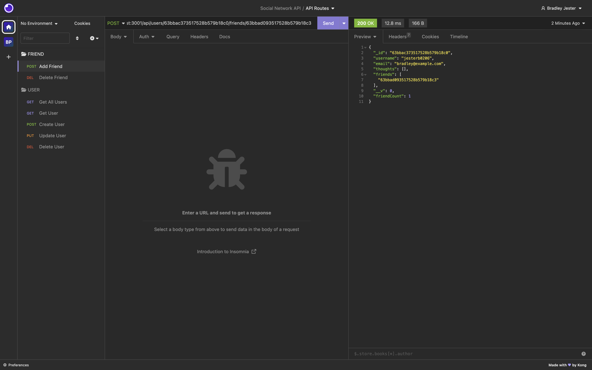

 

To delete a friend from a user's friend list, make a **DELETE** request in Insomnia/Postman/etc. to `http://localhost:3001/api/users/:userid/friends/:friendId`, replacing **:userId** with that user's unique ID and **:friendId** with the unique ID of the user that they wish to unfriend.

 

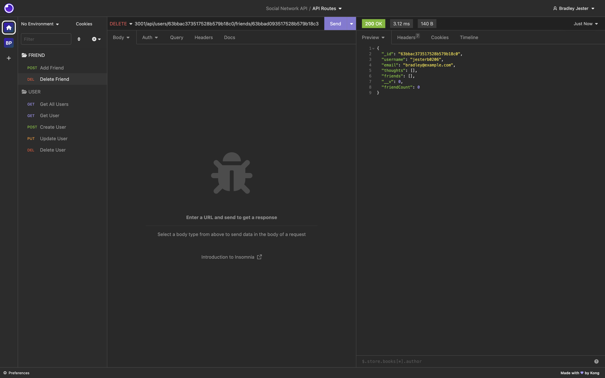

 

To create a thought, make a **POST** request in Insomnia/Postman/etc. to `http://localhost:3001/api/thoughts`, with the user's **thoughtText**, **username** and **userId** in **JSON format**.

 

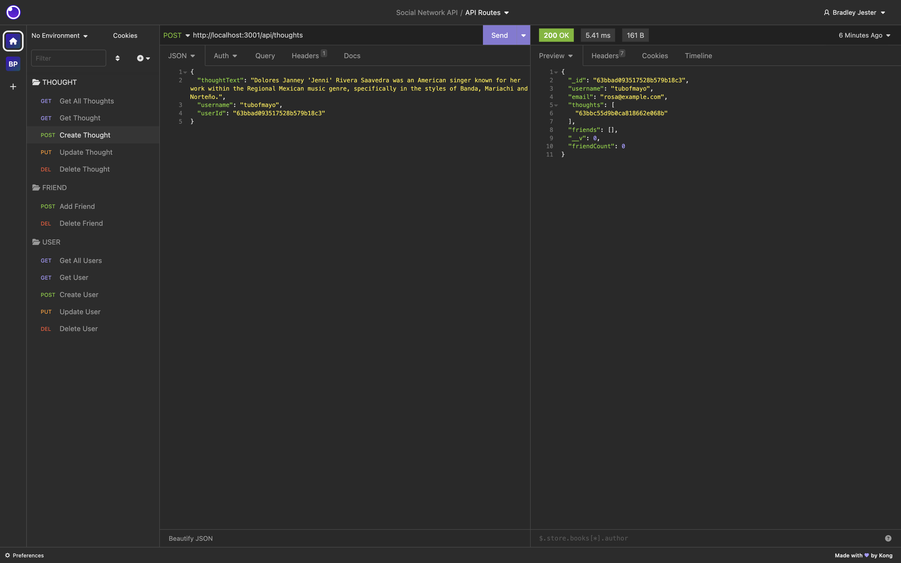

 

To get a specific thought, make a **GET** request in Insomnia/Postman/etc. to `http://localhost:3001/api/thoughts/:thoughtId`, replacing **:thoughtId** with that thought's unique ID.

 

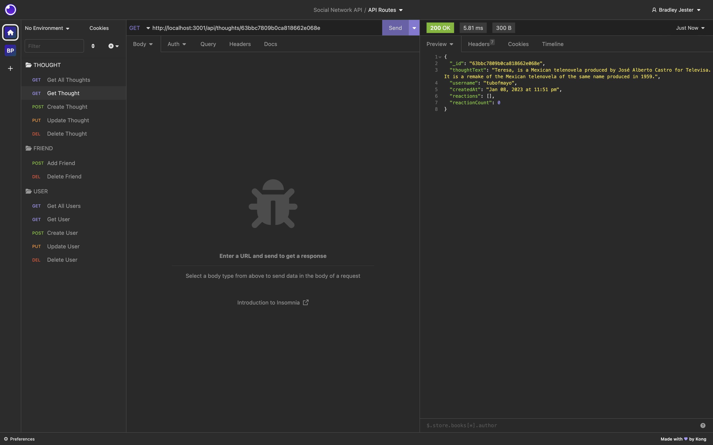

 

To get all of the thoughts, make a **GET** request in Insomnia/Postman/etc. to `http://localhost:3001/api/thoughts`. **Note**, earlier I was having an error where when I went to create a thought the corresponding user was not found, that has since been fixed but that's why it appears like the same thought has been created many times.

 

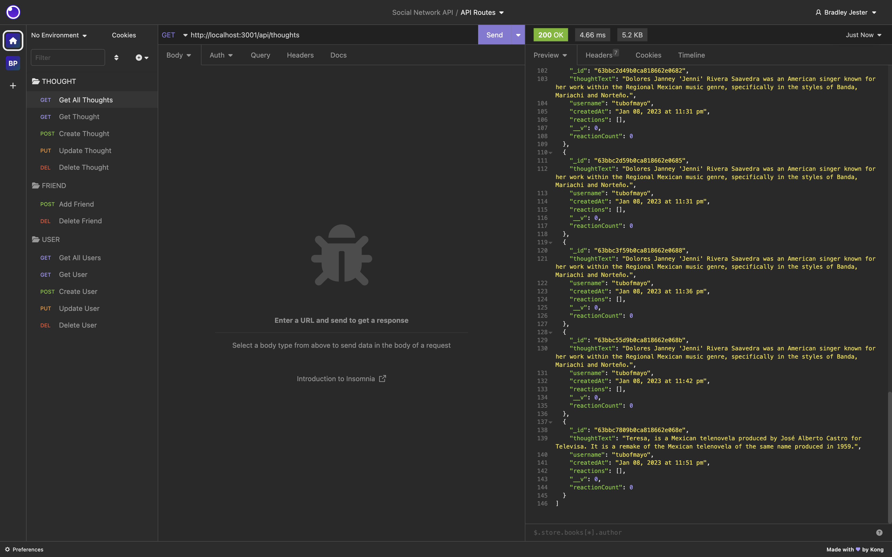

 

To update a specific thought, make a **PUT** request in Insomnia/Postman/etc. to `http://localhost:3001/api/thoughts/:thoughtId` (in **JSON format**), replacing **:thoughtId** with that thought's unique ID.

 

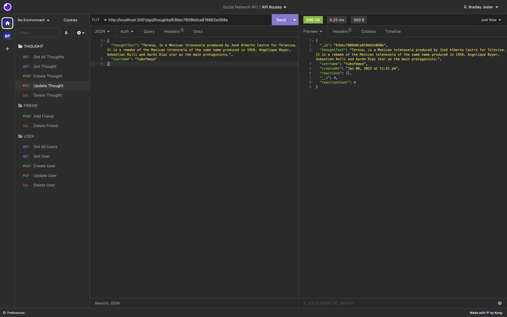

 

To delete a specific thought, make a **DELETE** request in Insomnia/Postman/etc. to `http://localhost:3001/api/thoughts/:thoughtId`, replacing **:thoughtId** with that thought's unique ID.

 

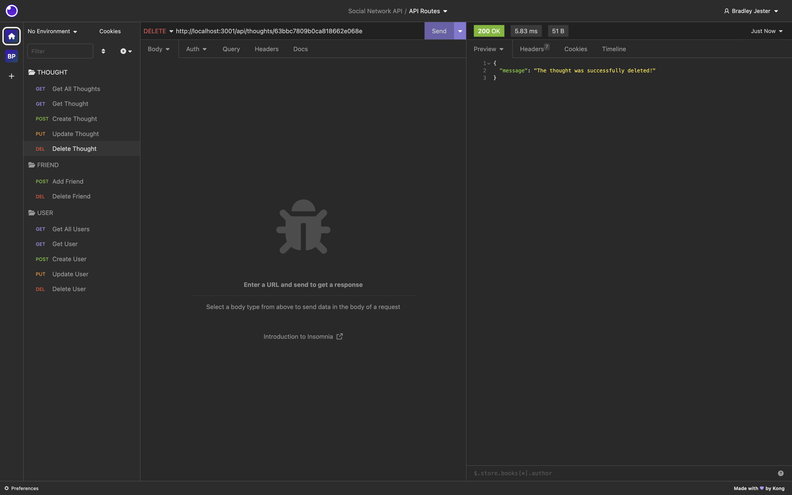

 

To create a reaction, make a **POST** request in Insomnia/Postman/etc. to `http://localhost:3001/api/thoughts/:thoughtId/reactions`, replacing **:thoughtId** with the thought ID of the thought you're reacting to, and with the reaction's **reactionBody**, and your **username** in **JSON format**.

 

 

To delete a reaction, make a **DELETE** request in Insomnia/Postman/etc. to `http://localhost:3001/api/thoughts/:thoughtId/reactions/:reactionId`, replacing **:thoughtId** with the thought Id that corresponds to the reaction you're trying to delete, and **:reactionId** with the reaction Id of the reaction you're trying to delete.

 

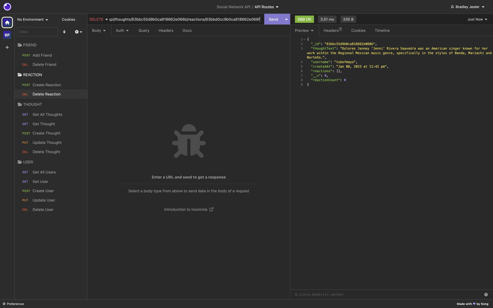
