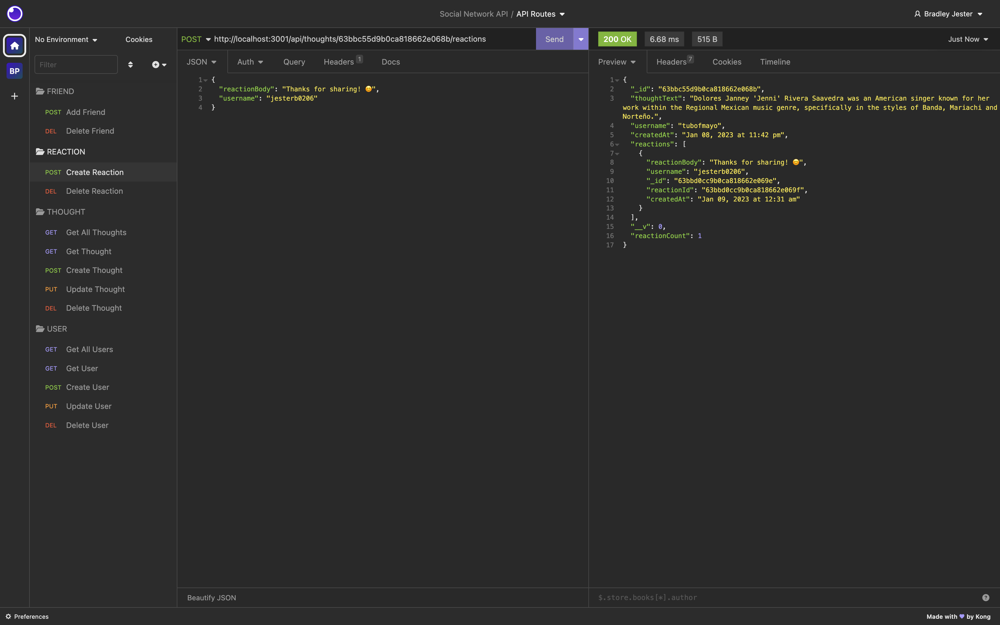

# Social Network API

 

## License

 

[This application is under the MIT license](https://opensource.org/licenses/MIT)

 

## Walkthrough Video

 

**To-Do**

 

## Table of Contents

 

- [Social Network API](#social-network-api)
  - [License](#license)
  - [Walkthrough Video](#walkthrough-video)
  - [Table of Contents](#table-of-contents)
  - [Description](#description)
  - [Installation](#installation)
  - [Usage](#usage)
  - [Badges](#badges)
  - [Questions](#questions)
    - [GitHub](#github)
    - [Email](#email)

<small><i><a href='http://ecotrust-canada.github.io/markdown-toc/'>Table of contents generated with markdown-toc</a></i></small>

 

## Description

 

An API for a social network web application where users can share their thoughts, react to friends’ thoughts, and create a friend list. Social Network API uses Express.js for routing, a MongoDB database, the Mongoose ODM and Moment.js to format timestamps on query. Also, the API routes were tested using Insomnia.

 

## Installation

 

Clone the repository to your local machine, open your terminal, and navigate to the root folder in the **Social Network API** repository. To install the necessary dependencies, run `npm i` in your command-line terminal.

 

## Usage

 

To begin running the application, open your terminal, navigate to the root folder in the **Social Network API** repository, and run `npm start`. Also, make sure you have MongoDB installed!

 

To create a user, make a **POST** request in Insomnia/Postman/etc. to `http://localhost:3001/api/users`, with the user's **username** and **email** in **JSON format**.

 

 

To get a specific user, make a **GET** request in Insomnia/Postman/etc. to `http://localhost:3001/api/users/:userId`, replacing **:userId** with that user's unique ID.

 

 

To get all of the users, make a **GET** request in Insomnia/Postman/etc. to `http://localhost:3001/api/users`.

 

 

To update a specific user, make a **PUT** request in Insomnia/Postman/etc. to `http://localhost:3001/api/users/:userId` (in **JSON format**), replacing **:userId** with that user's unique ID.

 

 

To delete a specific user, make a **DELETE** request in Insomnia/Postman/etc. to `http://localhost:3001/api/users/:userId`, replacing **:userId** with that user's unique ID.

 

 

To add a friend to a user's friend list, make a **POST** request in Insomnia/Postman/etc. to `http://localhost:3001/api/users/:userid/friends/:friendId`, replacing **:userId** with that user's unique ID and **:friendId** with the unique ID of the user that they wish to become friends with.

 

 

To delete a friend from a user's friend list, make a **DELETE** request in Insomnia/Postman/etc. to `http://localhost:3001/api/users/:userid/friends/:friendId`, replacing **:userId** with that user's unique ID and **:friendId** with the unique ID of the user that they wish to unfriend.

 

 

To create a thought, make a **POST** request in Insomnia/Postman/etc. to `http://localhost:3001/api/thoughts`, with the user's **thoughtText**, **username** and **userId** in **JSON format**.

 

 

To get a specific thought, make a **GET** request in Insomnia/Postman/etc. to `http://localhost:3001/api/thoughts/:thoughtId`, replacing **:thoughtId** with that thought's unique ID.

 

 

To get all of the thoughts, make a **GET** request in Insomnia/Postman/etc. to `http://localhost:3001/api/thoughts`. **Note**, earlier I was having an error where when I went to create a thought the corresponding user was not found, that has since been fixed but that's why it appears like the same thought has been created many times.

 

 

To update a specific thought, make a **PUT** request in Insomnia/Postman/etc. to `http://localhost:3001/api/thoughts/:thoughtId` (in **JSON format**), replacing **:thoughtId** with that thought's unique ID.

 

 

To delete a specific thought, make a **DELETE** request in Insomnia/Postman/etc. to `http://localhost:3001/api/thoughts/:thoughtId`, replacing **:thoughtId** with that thought's unique ID.

 

 

To create a reaction, make a **POST** request in Insomnia/Postman/etc. to `http://localhost:3001/api/thoughts/:thoughtId/reactions`, replacing **:thoughtId** with the thought ID of the thought you're reacting to, and with the reaction's **reactionBody**, and your **username** in **JSON format**.

 

 

To delete a reaction, make a **DELETE** request in Insomnia/Postman/etc. to `http://localhost:3001/api/thoughts/:thoughtId/reactions/:reactionId`, replacing **:thoughtId** with the thought Id that corresponds to the reaction you're trying to delete, and **:reactionId** with the reaction Id of the reaction you're trying to delete.

 

 

## Badges

 

 

 

 

 

 

 

 

 

 

 

 

## Questions

 

If you have any additional questions, you can reach me at:

 

### GitHub

 

 

[jesterb0206](https://www.github.com/jesterb0206)

 

### Email

 

 

jesterb@seattleu.edu

 

 

 

 
